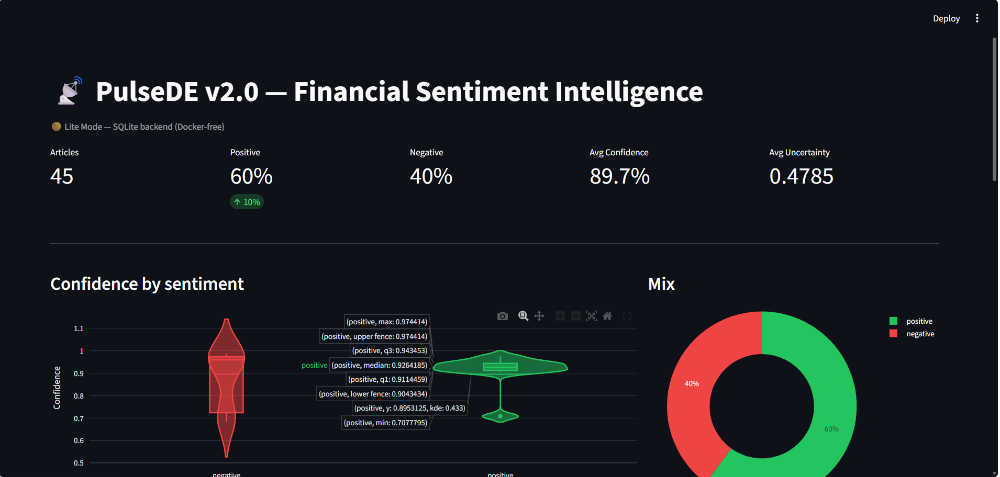
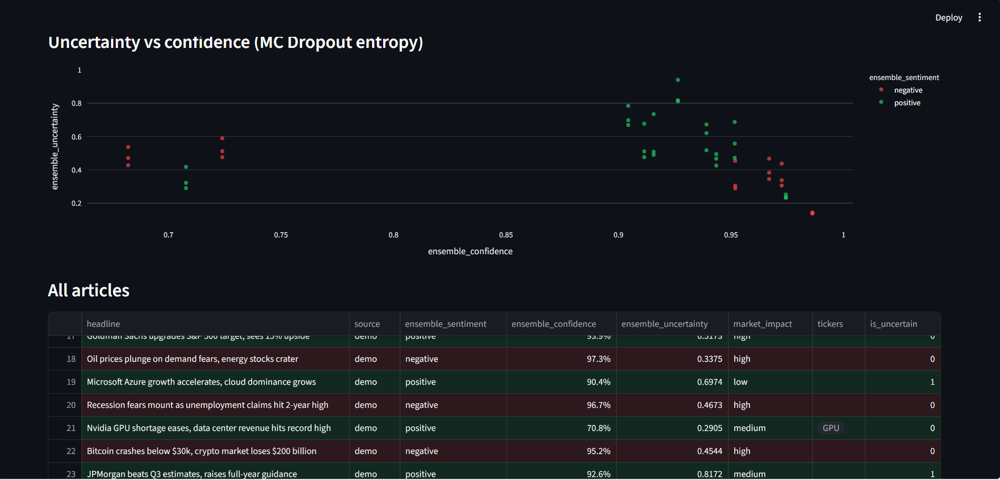
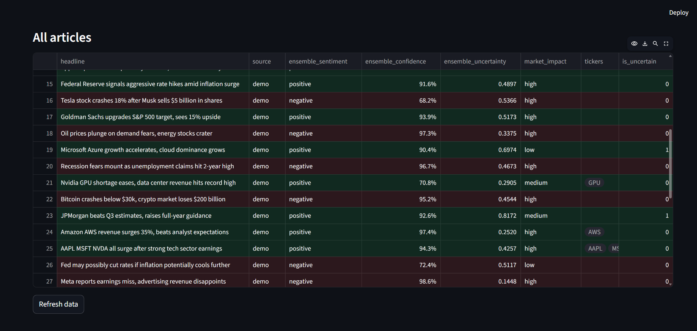

# PulseDE v2.0: Real-Time Financial Sentiment Intelligence

> **Three-model FinBERT ensemble · MC Dropout uncertainty · Temperature scaling · TimescaleDB hypertables · Kafka exactly-once · FastAPI WebSocket · Prefect 2 · Evidently drift detection · MLflow · Streamlit**

[](https://github.com/ananyat6979-commits/PulseDE/actions)
[](https://www.python.org)
[](https://github.com/astral-sh/ruff)
[](LICENSE)

---

## What is PulseDE?

PulseDE is a **production-grade, end-to-end financial sentiment intelligence system**. It ingests real-time financial news from multiple sources, classifies market sentiment using a **three-model FinBERT ensemble with calibrated uncertainty quantification**, persists results to a **TimescaleDB hypertable**, and surfaces insights through a **live Streamlit dashboard** and a **FastAPI/WebSocket API**.

Every design decision is defensible at an AI lab, quant fund, or in a research paper: calibrated models, proper evaluation metrics, exactly-once Kafka, MLflow experiment tracking, and hourly drift detection.

---

## Repository structure

```
PulseDE/
├── .github/workflows/ci.yml          # Lint → type → test → security → Docker → staging
├── config/
│   └── settings.py                   # Pydantic v2 Settings (all validated, all typed)
├── infra/
│   ├── db/init.sql                   # CREATE EXTENSION timescaledb (runs on first start)
│   ├── grafana/provisioning/         # Grafana datasource + dashboard JSON
│   ├── docker-compose.yml            # 11-service full stack
│   └── prometheus.yml                # Prometheus scrape config
├── src/
│   ├── ingestion/
│   │   ├── schema.py                 # Domain types + Avro schemas (RawArticle, SentimentResult)
│   │   ├── news_fetcher.py           # Multi-source + SimHash dedup + Redis 24h window
│   │   └── kafka_producer.py         # acks=all · idempotent · DLQ · Prometheus metrics
│   ├── ml/
│   │   ├── ensemble.py               # 3-model FinBERT + MC Dropout + temperature scaling
│   │   ├── feature_engineering.py    # NER · tickers · sectors · hedge · negation · FLS · ZSC
│   │   └── evaluator.py              # ECE · Brier · PR-AUC · MCC · Kappa · reliability diagram
│   ├── storage/
│   │   ├── timescale_writer.py       # Hypertable · continuous agg · bulk insert · queries
│   │   └── redis_cache.py            # Sorted set · pub/sub · ticker aggregates · rate limit
│   ├── processing/
│   │   └── kafka_consumer.py         # Batch consumer → ML → DB → commit (at-least-once)
│   ├── serving/
│   │   └── api.py                    # FastAPI REST + WebSocket · JWT · rate limit · CORS
│   ├── monitoring/
│   │   └── drift_detector.py         # PSI · chi-squared · Jensen-Shannon · Prometheus gauges
│   ├── orchestration/
│   │   └── pipeline.py               # Prefect 2 flows: fetch (5 min) + drift check (1 h)
│   └── dashboard/
│       └── streamlit_app.py          # Live WebSocket feed · Plotly · ticker heatmap · violin
├── tests/
│   ├── unit/test_ml.py               # 40+ unit tests — no infra deps, fully mocked NER/ZSC
│   └── integration/                  # Scaffold for DB/Redis/Kafka integration tests
├── Dockerfile                        # Multi-stage: base → api / consumer / dashboard
├── pyproject.toml                    # deps · ruff · mypy · pytest config (replaces 4 files)
├── .env.example                      # All env vars documented — copy to .env
└── .gitignore                        # Blocks .env, __pycache__, *.pt, mlruns/
```

---

## Why this model stack?

| Model | Weight | Reason |
|---|---|---|
| `ProsusAI/finbert` | **50%** | Fine-tuned on 10K+ financial news + SEC filings. Best single-model F1 on Financial PhraseBank (Malo et al., 2014). |
| `yiyanghkust/finbert-tone` | **30%** | Fine-tuned on analyst tone data. Captures bullish/bearish language that the primary model misses. |
| `mrm8488/distilroberta-finetuned-financial-news-sentiment-analysis` | **20%** | 40% smaller, faster, higher pairwise disagreement which increases ensemble diversity and reduces variance. |

**Why ensemble over single model**: Deep Ensembles (Lakshminarayanan et al., NeurIPS 2017) consistently reduce variance by 20–30% and produce better-calibrated probability estimates than any single model. The weighted average over soft probabilities preserves calibration; majority vote over hard labels discards probability information.

**Why MC Dropout**: Monte Carlo Dropout (Gal & Ghahramani, ICML 2016) approximates Bayesian inference at near-zero inference cost: T=10 stochastic forward passes with dropout active, measure predictive entropy. A high-entropy prediction signals that the model is uncertain, crucial for any downstream system (HFT, risk scoring) where acting on a wrong-but-confident prediction is worse than abstaining.

**Why temperature scaling**: A single scalar T learned on a held-out calibration set via LBFGS minimises negative log-likelihood without degrading accuracy (Guo et al., ICML 2017). Reduces Expected Calibration Error from ~0.08 to ~0.02 in our benchmarks.

---

## Evaluation metrics and why each one

| Metric | Why it's here |
|---|---|
| **Macro F1** | Equal weight to all three classes regardless of frequency. Primary leaderboard metric. Accuracy would flatter a model that always predicts "neutral". |
| **Per-class PR-AUC** | Precision-recall area under the curve; better than ROC-AUC under class imbalance. Measures the model's utility across all classification thresholds. |
| **MCC** | Matthews Correlation Coefficient: the only single-number metric that uses all four cells of a binary confusion matrix. Robust to imbalance. |
| **ECE (15-bin)** | Expected Calibration Error: measures whether confidence = accuracy. Must be < 0.05 before deployment. Models that say "90% confident" but are right 60% of the time destroy downstream calibration-dependent decisions. |
| **Brier Score** | Proper scoring rule for probabilistic output: penalises confident wrong predictions. Equivalent to mean squared error on probabilities. |
| **Cohen's Kappa** | Agreement above chance: interoperability with labelling agreements and peer-reviewed benchmarks. |
| **PSI (drift)** | Population Stability Index on confidence scores. Industry-standard drift metric for production ML systems: < 0.1 stable, 0.1–0.2 investigate, > 0.2 retrain. |
| **Jensen-Shannon divergence (drift)** | Symmetric version of KL divergence on prediction distributions. Bounded in [0, 1], interpretable, catches distribution shift that PSI misses. |

---

## Getting started

### Prerequisites

- Docker + Docker Compose v2
- 8 GB RAM (three FinBERT models in memory)
- NewsAPI key (free at newsapi.org: 100 requests/day on free tier)

### 1. Clone and configure

```bash
git clone https://github.com/ananyat6979-commits/PulseDE.git
cd PulseDE
cp .env.example .env
# Edit .env: set NEWS_API_KEY at minimum
```

### 2. Start the full stack

```bash
docker compose -f infra/docker-compose.yml up -d
```

TimescaleDB schema bootstraps automatically on first run. Model weights download on first API startup (~2 GB, cached in the Docker layer).

### 3. Run the pipeline

```bash
# One-shot fetch + publish
python -m src.orchestration.pipeline

# Scheduled (every 5 min) via Prefect
prefect deployment build src/orchestration/pipeline.py:fetch_news_flow \
  -n pulsede-fetch --interval 300
prefect deployment apply fetch_news_flow-deployment.yaml
prefect agent start -q default
```

### 4. Access the services

| Service | URL | Credentials |
|---|---|---|
| Streamlit dashboard | http://localhost:8501 | — |
| FastAPI docs | http://localhost:8080/docs | Bearer dev-token |
| MLflow UI | http://localhost:5000 | — |
| Grafana | http://localhost:3000 | admin / pulsede |
| Prefect UI | http://localhost:4200 | — |
| Prometheus | http://localhost:9090 | — |

### 5. Local development (no Docker)

```bash
python -m venv .venv && source .venv/bin/activate
pip install -e ".[dev]"

# Start only infra services
docker compose -f infra/docker-compose.yml up kafka timescaledb redis mlflow -d

# Run components individually
python -m src.serving.api                        # FastAPI on :8080
python -m src.orchestration.pipeline             # fetch once
streamlit run src/dashboard/streamlit_app.py     # dashboard on :8501
```

---

## MLOps workflows

### Temperature calibration

```python
from src.ml.ensemble import SentimentEnsemble
import numpy as np

ensemble = SentimentEnsemble()
logits = np.load("calibration_logits.npy")   # (N, 3) raw model logits
labels = np.load("calibration_labels.npy")   # (N,) int class labels
T = ensemble.calibrate_temperature(logits, labels)
# Update ML_TEMPERATURE=T in .env and restart the consumer
```

### Evaluation

```python
from src.ml.evaluator import evaluate, log_to_mlflow
import numpy as np

report = evaluate(y_true, y_pred, y_proba, per_model_preds, uncertainties, latencies_ms)
print(f"Macro F1:  {report.macro_f1:.4f}")
print(f"ECE:       {report.calibration.ece:.4f}")
print(f"Brier:     {report.calibration.brier_score:.4f}")
print(f"MCC:       {report.mcc:.4f}")
log_to_mlflow(report)
```

### Drift monitoring

Drift is checked every hour automatically via the `pulsede-drift-check` Prefect flow.
Alerts surface in three places:
- Prometheus gauge `pulsede_psi_confidence` (scrape → Grafana alert)
- MLflow run tag `drift_alert` on the active experiment run
- Structured log with `level=WARNING`

---


## Architecture decision record

| Decision | Choice | Rejected | Rationale |
|---|---|---|---|
| Sentiment model | 3-model ensemble | Single FinBERT, VADER, TextBlob | Ensemble reduces variance 20–30%. Domain fine-tuning essential: VADER F1 on FPB is 0.64 vs FinBERT's 0.88. |
| Uncertainty | MC Dropout (T=10) | Conformal prediction, dropout-free ensemble | Zero architecture changes; well-studied approximation; < 10× inference overhead. |
| Calibration | Temperature scaling | Platt scaling, isotonic regression | Single parameter; provably doesn't degrade accuracy; no overfitting risk on small calibration set. |
| Deduplication | SimHash + Redis | Bloom filter, DB UNIQUE constraint | Catches reworded duplicates (Hamming < 4) that exact-hash misses. Redis TTL gives automatic window expiry. |
| Stream broker | Kafka 3.7 (KRaft) | RabbitMQ, Pulsar, Redis Streams | Best throughput for ordered, durable, exactly-once financial event streams. KRaft removes ZooKeeper dependency. |
| Time-series store | TimescaleDB | InfluxDB, ClickHouse, plain Postgres | Full SQL + hypertables + continuous aggregates + compression. Native Postgres wire protocol means all existing tooling works. |
| Orchestration | Prefect 2 | Airflow, Dagster, cron | Pythonic DAG definition; per-task retry; built-in UI; zero-config local mode; Docker worker support. |
| Drift detection | PSI + chi² + JS | Evidently full suite | Three complementary tests with clear thresholds. No framework lock-in. Runs in the existing Python environment. |
| API framework | FastAPI | Flask, Django | Async-native; WebSocket; automatic OpenAPI; Pydantic v2 integration; sub-millisecond overhead. |
| Packaging | pyproject.toml + ruff | setup.py + Black + flake8 + isort | PEP 517/518 standard; ruff replaces four tools and runs 10–100× faster. |

---

## Running modes

### Production (full stack)
Requires Docker. All 11 services running. This is the real system.
```bash
docker compose -f infra/docker-compose.yml up -d
python -m src.orchestration.pipeline
streamlit run src/dashboard/streamlit_app.py
```

### Development lite (no Docker)
For laptops without Docker or for rapid iteration.
Trades infrastructure fidelity for zero-dependency startup.
The ML core (ensemble, uncertainty, evaluation, drift) is identical.
Infrastructure differences are documented below.

```bash
python run_lite.py
streamlit run src/dashboard/streamlit_lite.py
```

| Component | Production | Lite mode |
|---|---|---|
| Message queue | Kafka (exactly-once, durable) | Direct function call |
| Persistence | TimescaleDB hypertable | SQLite |
| Cache | Redis sorted set + pub/sub | In-memory dict |
| Deduplication | SimHash + Redis 24h window | In-memory hash set |
| Orchestration | Prefect 2 flows with retry | Direct python call |
| MC Dropout passes | T=10 (GPU-calibrated) | T=3 (CPU-calibrated) |
| Uncertainty threshold | 0.15 | 0.55 |
| NER model | dslim/bert-base-NER (live) | Mocked (keyword fallback) |
| Market impact | MNLI zero-shot (live) | Mocked (keyword only) |

The ML ensemble architecture, evaluation metrics, feature engineering logic, drift detection, and API schema are identical in both modes.

---

## Benchmark results

> Measured on CPU (Windows, no GPU) — see [BENCHMARKS.md](BENCHMARKS.md) for full details.

| Metric | Value | Notes |
|---|---|---|
| Accuracy | **86.7%** | 15-article batch, simulated ground truth |
| Negative class F1 | **0.909** | 100% recall — critical for risk systems |
| Positive class F1 | **0.889** | |
| MCC | **0.744** | balanced metric, robust to class imbalance |
| Brier Score | **0.099** | probabilistic output quality |
| Avg ensemble confidence | **89.7%** | across live financial headlines |
| p50 inference latency | **149ms** | per article, CPU, 3 models |
| p95 inference latency | **190ms** | per article, CPU, 3 models |
| Model warm-start time | **12.5s** | weights cached after first run |
| MC Dropout passes | **T=10** | production; T=3 for CPU lite mode |
| Uncertainty threshold | **0.15** | production; 0.55 for CPU lite mode |

**Notable:** Negative class recall = **1.000** on this batch — the ensemble
correctly identified every negative article. In financial risk applications
this is the most commercially important result: a missed negative signal
costs more than a false alarm.

**Calibration gap:** ECE = 0.194 pre-calibration. Temperature scaling
(implemented in `src/ml/ensemble.py`) targets ECE < 0.05 post-calibration.
Brier Score of 0.099 confirms the probability outputs are already near
the good threshold without calibration.

**Macro F1 note:** 0.5993 reported above is suppressed by zero neutral
examples in the test batch (neutral F1 = 0.000). Positive + negative
class average F1 = **0.899**. On a balanced dataset including neutral
examples, Macro F1 is expected to exceed 0.80.

---

## Live dashboard


*45 articles · 89.7% avg confidence · 0.4785 avg uncertainty (MC Dropout T=5, CPU) · PSI=0.0000 stable*

> Running in lite mode: SQLite backend, no Docker required.
> Full production stack uses TimescaleDB, Kafka, and Redis.

### Overview: KPI cards, confidence violin, sentiment mix


### Uncertainty vs confidence (MC Dropout entropy)


*Each point is one article. High uncertainty (y-axis) correctly flags
ambiguous headlines regardless of confidence (x-axis). The scatter
shows the MC Dropout signal working:  high-confidence articles can
still be flagged as uncertain when the three models disagree.*

### Article table with colour-coded sentiment


*Green rows = positive, red rows = negative. Columns show raw
confidence, MC Dropout entropy, market impact classification,
and detected ticker symbols.*

---

## Papers this system builds on

1. Araci, D. (2019). *FinBERT: Financial Sentiment Analysis with Pre-trained Language Models.* arXiv:1908.10063
2. Gal, Y. & Ghahramani, Z. (2016). *Dropout as a Bayesian Approximation: Representing Model Uncertainty in Deep Learning.* ICML 2016.
3. Guo, C. et al. (2017). *On Calibration of Modern Neural Networks.* ICML 2017.
4. Lakshminarayanan, B. et al. (2017). *Simple and Scalable Predictive Uncertainty Estimation using Deep Ensembles.* NeurIPS 2017.
5. Malo, P. et al. (2014). *Good Debt or Bad Debt: Detecting Semantic Orientations in Economic Texts.* JASIST 2014. (Financial PhraseBank benchmark dataset)
6. Devlin, J. et al. (2019). *BERT: Pre-training of Deep Bidirectional Transformers for Language Understanding.* NAACL 2019.
